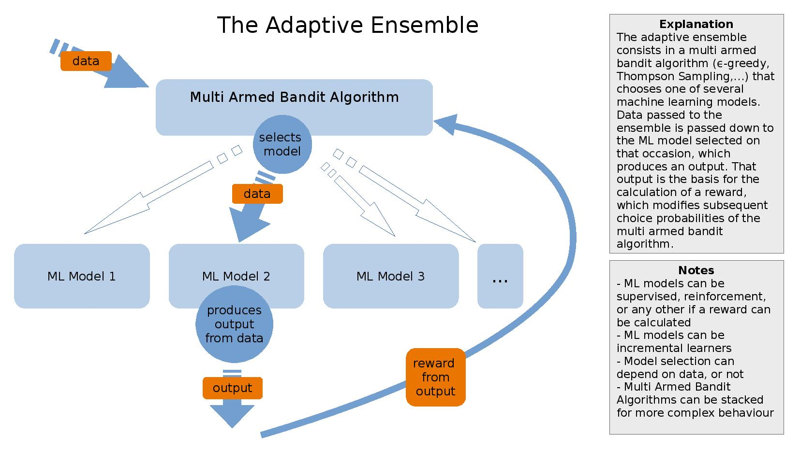

<!-- ABOUT THE PROJECT -->
## AdaEnsemble

AdaEnsemble is a framework for creating adaptive ensembles. An adaptive ensemble consists in a multi armed bandit algorithm that chooses between different machine learning models, and passes the data passed to the ensemble down to the selected machine learning model. The output of the selected model, given the data, is the output of the ensemble. This can be used for online model selection over supervised machine learning models, or as another layer to reinforcement learning algorithms. For broad applications, see this [blog entry](https://leonluithlen.eu/blog/ada-ensemble-three-patterns) on my website.

### Built With

AdaEnsemble relies on [Breeze](https://github.com/scalanlp/breeze) for matrix operations, [Smile](https://haifengl.github.io/) for incremental machine learning, [Circe](https://circe.github.io/circe/) for constructing Json representations of ensembles and [JavaCPP](https://github.com/bytedeco/javacpp) for the intergration of [ONNX](https://onnx.ai/) models.

<!-- USAGE EXAMPLES -->
## Usage

For a brief overview over the classes needed to construct an adaptive ensemble, and the basic pattern to create one, se [here.](https://leonluithlen.eu/blog/ada-ensemble-technical-introduction)

<!-- LICENSE -->
## License

Distributed under the [LGPL](./LGPL) License.

<!-- CONTACT -->
## Contact

[leon luithlen](https://leonluithlen.eu) - [@leontist](https://twitter.com/leontist)

